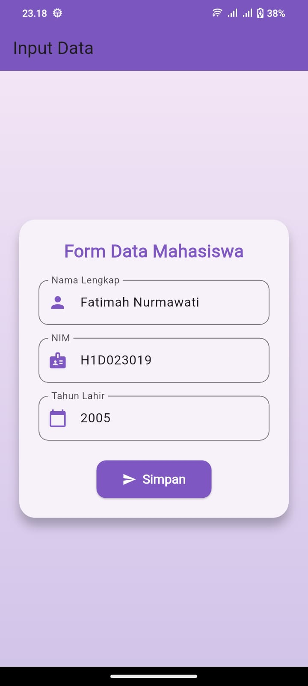
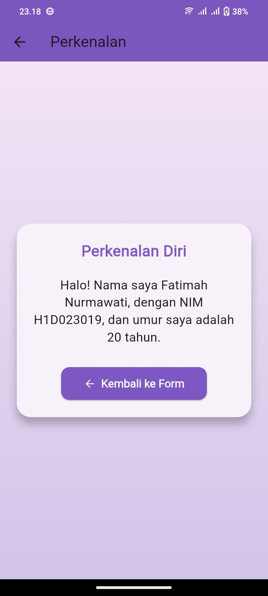
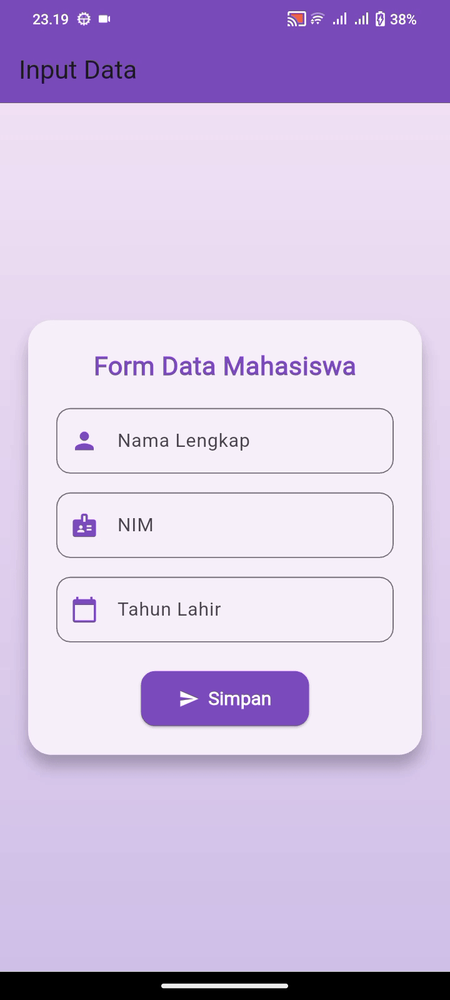

##  Tugas 6 Flutter - Form dan Tampil Data Mahasiswa

**Nama:** Fatimah Nurmawati
**NIM:** H1D023019
**Shift:** C

---

### Deskripsi Aplikasi

Dibuat menggunakan **Flutter** dengan tujuan untuk:

* Menampilkan **form input data mahasiswa** (Nama, NIM, dan Tahun Lahir).
* Menampilkan hasil input dalam bentuk **kalimat perkenalan** di halaman selanjutnya.

Aplikasi terdiri dari dua halaman utama:

* **`FormDataPage` (`ui/form_data.dart`)**: Halaman pengisian data mahasiswa.
* **`TampilDataPage` (`ui/tampil_data.dart`)**: Halaman menampilkan hasil input data dengan tampilan menarik.

---

### Proses Passing Data

Proses mengirimkan data dari satu halaman ke halaman lain di Flutter.
Pada aplikasi ini, data dikirim dari `FormDataPage` ke `TampilDataPage`.

#### Langkah-langkah

##### 1. Input Data di Form

Pengguna mengisi 3 `TextFormField`:

```dart
TextFormField(
  controller: _nameController,
  decoration: InputDecoration(labelText: 'Nama'),
),
TextFormField(
  controller: _nimController,
  decoration: InputDecoration(labelText: 'NIM'),
),
TextFormField(
  controller: _tahunController,
  decoration: InputDecoration(labelText: 'Tahun Lahir'),
),
```

##### 2. Tombol Simpan dan Navigasi
Saat tombol Simpan ditekan, aplikasi akan mengambil data dari form dan mengirimkannya ke halaman TampilDataPage menggunakan Navigator.push:
```dart
ElevatedButton(
  onPressed: () {
    String nama = _nameController.text;
    String nim = _nimController.text;
    int tahun = int.parse(_tahunController.text);
    int umur = DateTime.now().year - tahun;

    Navigator.push(
      context,
      MaterialPageRoute(
        builder: (context) => TampilDataPage(
          nama: nama,
          nim: nim,
          umur: umur,
        ),
      ),
    );
  },
  child: const Text('Simpan'),
),
```

##### 3. Menampilkan Data di Halaman Kedua
Pada halaman TampilDataPage, data diterima melalui konstruktor dan ditampilkan dalam bentuk kalimat perkenalan menggunakan widget Text:
```dart
Text('Nama saya $nama, NIM $nim, dan umur saya $umur tahun.')
```

---

### 📸 Tampilan Aplikasi
| Form                     | Tampilan                        | Gif                     |
|--------------------------|-------------------------------- |-------------------------|
|  | |  |